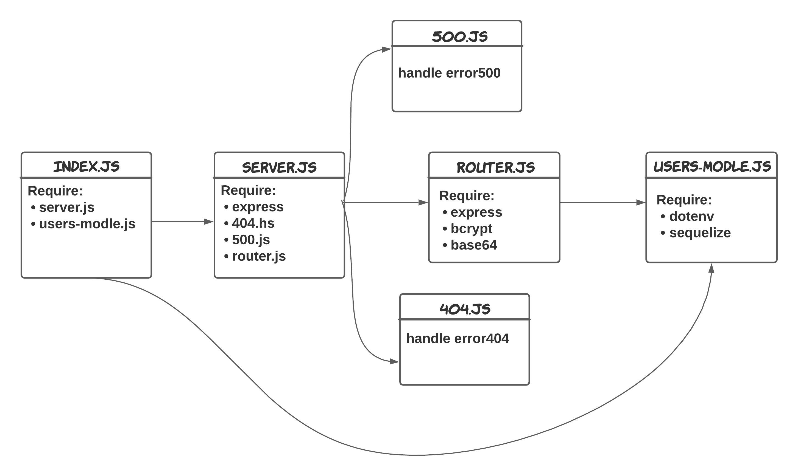

# **Basic-Authentication**
---

### **Summary work of the application**
Build Server app with some Authentication.

### **UML Diagram**

---

### **Heroku App**
🔗[Heroku App](https://omar-authentication-server.herokuapp.com/)
### **GitHub Action**
🔗[GitHub Actions](https://github.com/OmarSawalmeh/basic-auth/actions)
### **Pull Requests**
🔗[pull requests](https://github.com/OmarSawalmeh/basic-auth/pulls)
